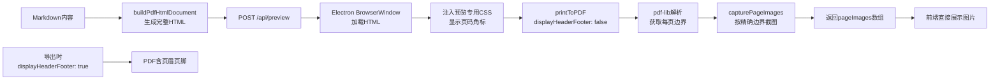

## 方案：用 Electron webview + printToPDF 替换 DOM 分页预览

### 核心思路

Obsidian 的关键设计：**预览和导出使用同一个 webview 的同一份 HTML/CSS**，预览用 `displayHeaderFooter: false` 获取截图展示，导出用 `displayHeaderFooter: true` 生成带页眉页脚的 PDF。前端直接展示 Electron 返回的 `pageImages` 截图，无需 DOM 分页计算。

当前项目的 `generatePdfPreview()` 在 Electron 端已完成这个流程（调用 `capturePageImagesByPdfBreaks`），但前端仍使用 `PdfPageView.vue` 的 DOM 分页逻辑，两者不同步。

---

### 改动文件

#### 1. `[electron/main.cjs](ai-interview-frontend/electron/main.cjs)`

**新增 `/api/preview-webview` 接口**（或者复用现有的 `/api/preview`，调整返回格式）：

沿用现有的 `generatePdfPreview()` 函数，它已经：

- 调用 `printToPDF({ displayHeaderFooter: false })` 生成纯净 PDF
- 用 `pdf-lib` 解析 PDF 获取每页 mediabox 高度
- 用 `capturePageImagesByPdfBreaks()` 按精确页边界截图

关键修改：增加一个 **preview 专用的 CSS 片段**，用于预览截图时显示页码角标和分页线。这个 CSS 只在截图阶段注入，**不出现在最终 PDF 中**：

```javascript
// 新增：预览专用 CSS（注入到 BrowserWindow，不影响 PDF 内容）
const PREVIEW_CSS = `
  <style>
    .preview-page-indicator {
      position: absolute;
      bottom: 12px;
      right: 16px;
      font-size: 10px;
      color: rgba(0,0,0,0.35);
      pointer-events: none;
      z-index: 3;
      font-family: -apple-system, BlinkMacSystemFont, sans-serif;
    }
    .preview-page-separator {
      position: absolute;
      top: 0;
      left: 0;
      right: 0;
      height: 12px;
      background: linear-gradient(to bottom, rgba(0,0,0,0.18), transparent);
      pointer-events: none;
    }
  </style>
`;
```

在 `capturePageImagesByPdfBreaks` 中，截图前通过 `webContents.executeJavaScript` 向 DOM 注入页码元素（每页不同的 `.preview-page-indicator`），截图完成后移除。这样每张预览图自带页码角标，无需前端合成。

#### 2. `[src/views/ResumeGeneratorNew.vue](ai-interview-frontend/src/views/ResumeGeneratorNew.vue)`

**移除 PdfPageView 组件，改用图片展示**：

将 `<PdfPageView>` 替换为简单的图片滚动展示容器：

```vue
<!-- 替换后的预览容器 -->
<div class="pdf-preview-container" v-if="rightPanelMode === 'print'">
  <div v-if="pdfPreviewLoading" class="preview-loading">
    <el-icon class="is-loading"><Loading /></el-icon>
    {{ pdfPreviewLoadingText }}
  </div>
  <div v-else class="preview-pages-scroll">
    
  </div>
</div>
```

样式：

```css
.preview-pages-scroll {
  display: flex;
  flex-direction: column;
  align-items: center;
  gap: 12px;
  overflow-y: auto;
  padding: 24px;
  background: #d0d0d0;
  height: 100%;
  box-sizing: border-box;
}
.preview-page-img {
  width: 794px;
  display: block;
  box-shadow: 0 4px 20px rgba(0,0,0,0.15);
}
```

数据来源：`pdfPreviewPages.value` 由 `fetchPreview()` 填充，Electron 返回的 `pageImages` 数组直接赋值给 `pdfPreviewPages`。

**废弃 `PdfPageView.vue**`：不再使用该组件，`rightPanelMode === 'print'` 时直接展示 Electron 返回的截图。

#### 3. `[src/views/ResumeGeneratorNew.vue](ai-interview-frontend/src/views/ResumeGeneratorNew.vue)` — `buildPdfHtmlDocument` 调整

`buildPdfHtmlDocument` 的 CSS 保持不变（纯净排版），**预览专用 CSS 由 Electron 端注入**，不污染 `buildPdfHtmlDocument` 的输出。

---

### 数据流




**关键一致性保证**：预览和导出的截图/导出都来自同一个 Electron BrowserWindow 实例、同一个 DOM、同一个 CSS 上下文，唯一的差异是 `displayHeaderFooter` 的布尔值——这是 Electron print 引擎内置的分层机制，不是 CSS 能控制的，所以绝不会出现预览/导出分页不匹配。

---

### 额外优化：预览体验增强

1. **分页加载**：Electron 已支持一次返回所有页的截图，无需额外改动
2. **页码角标**：由 Electron 在截图前注入到 DOM 中（`.preview-page-indicator`），每张截图自带页码，无需前端合成
3. **进度提示**：沿用现有的 `pdfPreviewLoading` + `pdfPreviewLoadingText`
4. **fallback 保留**：若 Electron 服务不可用，仍 fallback 到 `useExport`（html2canvas 路径），但此时预览和导出本身就不完美，属于降级体验

---

### 实现步骤

1. `**main.cjs**`：在 `capturePageImagesByPdfBreaks` 中，截图前通过 JS 注入页码角标 DOM 元素（每页不同），截图后移除。复用现有 `/api/preview` 接口，返回格式不变。
2. `**ResumeGeneratorNew.vue**`：
  - 将 `PdfPageView` 组件从模板中移除
  - 添加图片滚动预览容器（与 `markdown-body` 并列的条件渲染）
  - 简化 `fetchPreview` 返回值处理逻辑：`result.pageImages` 直接赋值给 `pdfPreviewPages.value`
3. **删除 `PdfPageView.vue**`：预览功能完全由 Electron 接管后，该文件不再需要。

